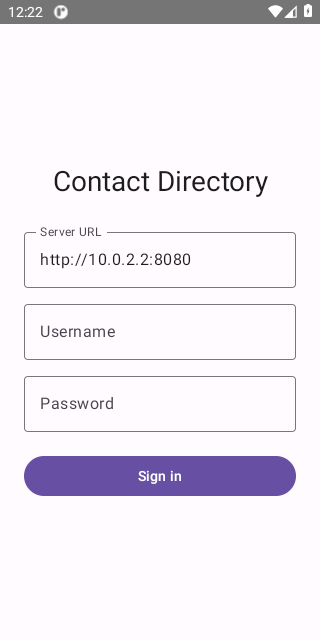
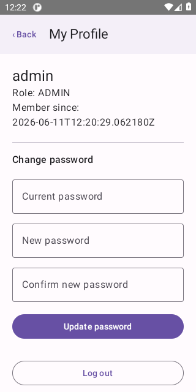
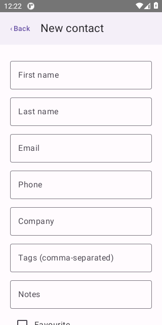
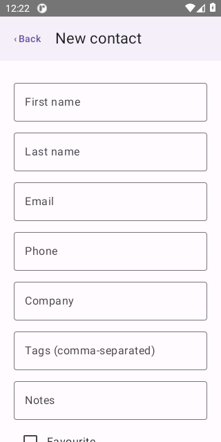
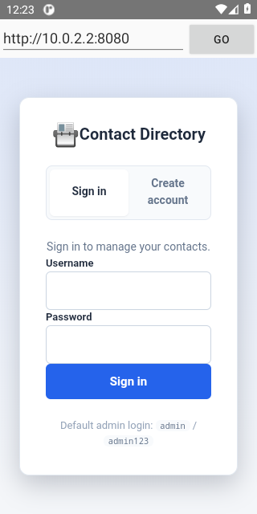

# Screenshots

Captured automatically on a CI emulator by the [Maestro](../../maestro) flows
(`maestro/smoke.yaml` and `maestro/webview-smoke.yaml`) — no manual capture.

## Native app (`:app` → `contact-directory.apk`)

| Login | Contacts | Search |
|---|---|---|
|  |  |  |

| Profile | New contact |
|---|---|
|  |  |

## WebView wrapper (`:webview` → `contact-directory-webview.apk`)

The thin native shell with an address bar, loading the web UI verbatim.

| Address bar | Web login loaded in the WebView |
|---|---|
|  |  |
